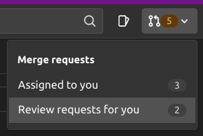

# Creating and reviewing merge request

## Creating merge request

A new Merge Request when created calls the configured webhook. The following occurs:

- App checks its a valid authentic request.
    - Authentication by checking the token passed with the webhook, see [architecture](./architecture.md).
    - Checks [webhook rules](#webhook-rules).
        - Fails: doesn't assign reviewer.
    - Select reviewer:
        - Requests list of suggested approvers matching [Code Owners](https://docs.gitlab.com/ee/user/project/code_owners.html)
          file in project.
        - Checks list of users against current slack status, removing unavailable users.
        - Selects random users from reamining list up to number of required approvers.
    - Updates MR with reviewers, see [review merge requests](#review-merge-requests)
    - Sends slack notification to [configured channel](./deployment.md#configuration-file) including `@fname.lname`.
        - No message sent if channel not configured.

### Webhook Rules

The following conditions for a MR required for a reviewer to be successfully set:

- Not a 'Work In Progress/Draft': Created MR is ready for review.
    - Setting to Work In Process/Draft removes currently selected reviewers
- Can merge: No conflicts or other issues blocking MR merge

### Select new reviewer

To assign another review to an MR remove a current Reviewer. This initiated the same process via the webhook call and
automatically assigns another random reviewer.

**note**: selection process being random means the reviewer removed can be randomly re-assigned.*

### Debugging

[Debugging](./debug.md)

## Review merge requests

Merge requests requested indicated in the GitLab UI under "Merge Requests" located at the top right.

## Remove reviewers

To remove the reviewers set the MR to Work In Progress/Draft.
