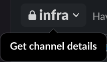
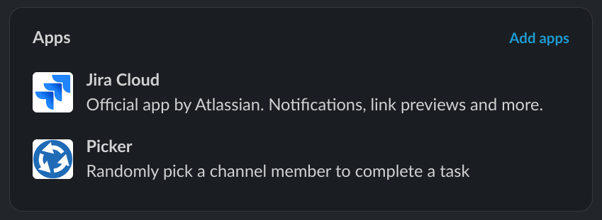
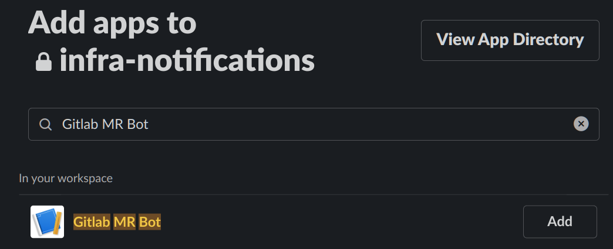

# Slack setup and configuration

## Slack Application

Setup and manage the app in a Slack workspace.

The configuration detailed below is for a base level of capability and requires refinement for security especially.

### Add new app to slack workspace

Requirements:

- Administration access to workspace

No public app exists and currently no intentions to create one. The requirements for the App are basic with only a token
passed to the deployment. The mechanisms for keeping the token secure and rotating left to each implementation.

Follow the Slack [build an App](https://api.slack.com/start/building) documentation to get a basic app available for
your workspace.

"Create New App" with option "From an app manifest" and follow the steps using the below manifest:

```
display_information:
  name: GitLab MR Bot
features:
  bot_user:
    display_name: GitLab MR Bot
    always_online: false
oauth_config:
  scopes:
    bot:
      - groups:read
      - users:read
      - users:read.email
      - chat:write
settings:
  org_deploy_enabled: false
  socket_mode_enabled: false
  token_rotation_enabled: false
```

#### Permissions

The App allows a basic set of permissions to access user information and send messages.

[Slack Scopes](https://api.slack.com/scopes)

| Scope                 | Description
| ---                   | ---
| `groups:read`         | Get list of user ids in a channel
| `users:read`          | Read details of a specific user, including [status](./set-slack-status.md)
| `users:read.email`    | Additional access to user email
| `chat:write`          | write a message to a channel.

### OAuth Token

The app requires an OAuth Token to authenticate when making API calls.

Created in the "OAuth & Permissions" section then "install to Workspace" from the available options. Read and "Allow"
the permission scopes as listed. On completion a "Bot User OAuth Token" made available to copy and required as part of
the [deployment.](./deployment.md) configuration passed as an environment variable.

## Add app to channel

Allow app to message specific channels by adding app.

Requirements:

- App added to workspace
- ToDo: what permissions required to add app to channel?

### Check app installed

Navigate to the `Get channel details` found by clicking the channel name in the Slack UI.

[](./images/slack-get-channel-id-1.png)

Check `Integrations` tab for `Gitlab MR Bot` or name used for [slack app](#slack-application).

[](./images/slack-check-channel-apps-1.png)

### Add app

Select the `Add apps` options and search for `Gitlab MR Bot` or name used for [slack app](#slack-application).

[](./images/slack-add-app-to-channel-1.png)

Select `Add` to add the app to the channel. The UI then returns to the channel showing:

[](./images/slack-add-app-to-channel-2.png)
